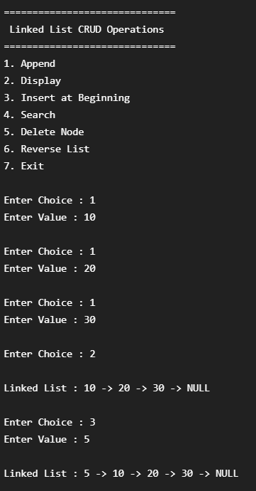
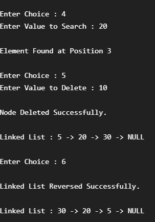

# Dynamic Memory Allocation using Linked List

## Project Description

This project demonstrates Dynamic Memory Allocation using a Singly Linked List in C++. It performs CRUD operations with dynamically allocated memory using `new` and `delete`.

## Features

- Append Node
- Display Linked List
- Insert at Beginning
- Search Node
- Delete Node
- Reverse Linked List

## Concepts Used

- Class & Object
- Constructor
- Dynamic Memory Allocation
- Linked List
- Pointer
- CRUD Operations

## Output Screenshots

