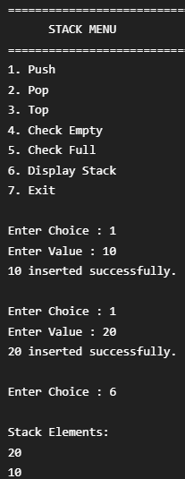
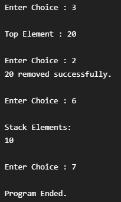

# Escalator - Stack Implementation in C++

## Project Overview

This project demonstrates the implementation of a Stack using an Array in C++. It is a menu-driven application that performs basic stack operations while following Object-Oriented Programming concepts.

---

## Features

- Push an element
- Pop an element
- Display top element
- Check whether stack is empty
- Check whether stack is full
- Display stack elements

---

## OOP Concepts Used

- Class & Object
- Encapsulation
- Inheritance
- Polymorphism

---

## Output

