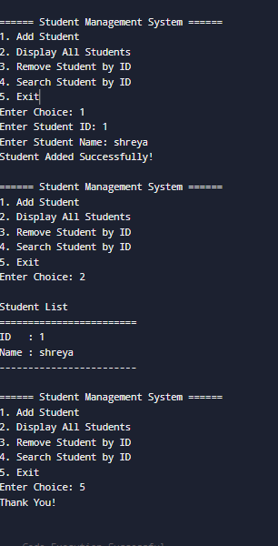

# Student Management System (Vector)

## Overview

This is a C++ project that implements a **Student Management System** using **STL Vector** and **Class Template**.

## Features

* Add Student
* Display All Students
* Search Student by ID
* Remove Student by ID

## Output

